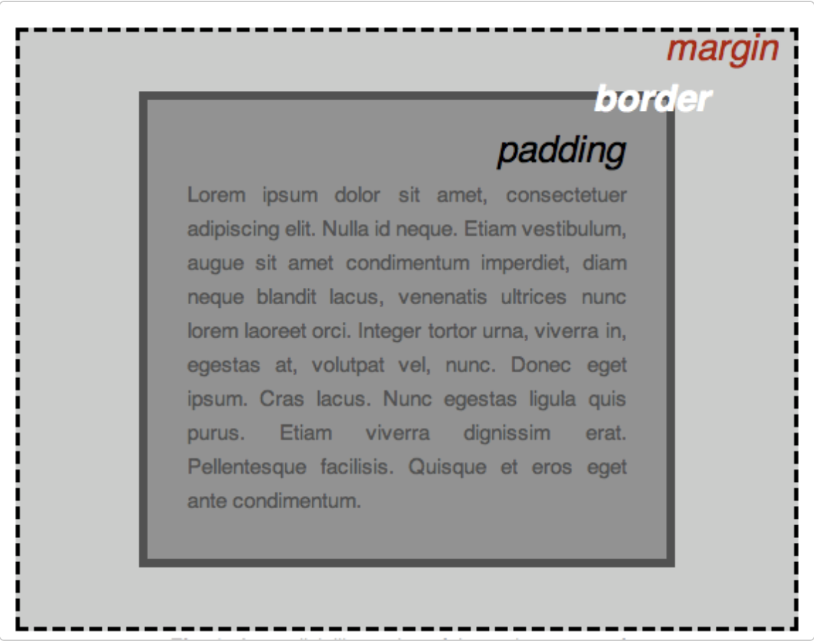

# Box
 
## Tipos

**padding (relleno)**, el espacio alrededor del contenido. En el ejemplo siguiente, es el espacio alrededor del texto del párrafo.

**border (marco)**, la línea que se encuentra fuera del relleno.

**margin (margen)**, el espacio fuera del elemento que lo separa de los demás.

## 