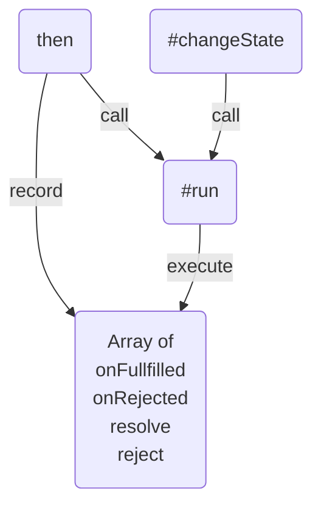

# Handle

```mermaid
graph TD;
    
    A( Array of <br> onFullfilled <br> onRejected <br> resolve <br> reject )
    B( #run)
    C(then)
    D(#changeState)
    C -- record --> A
    C -- call --> B
    B -- execute --> A
    D -- call --> B
```
